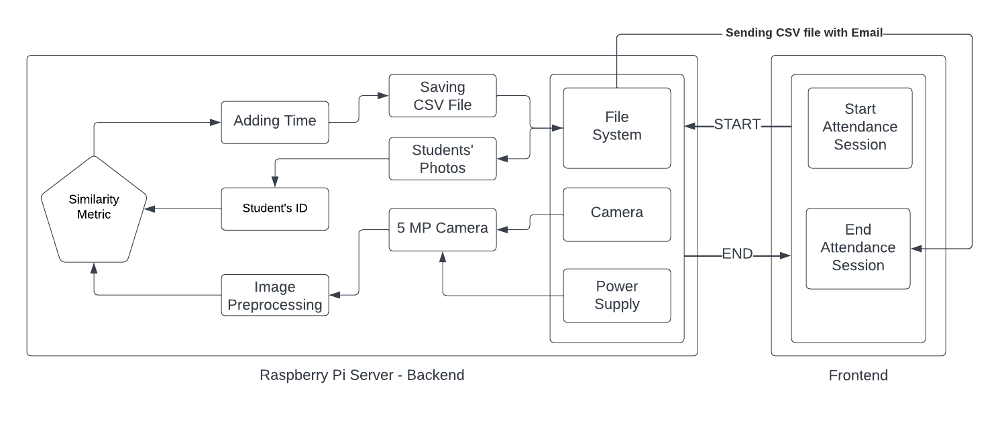

# Student Visual Attendance System

## 1. Introduction

Transforming the landscape of student attendance tracking, our system utilizes a more technological business solution by real-time capturing students' faces, with higher efficiency and accuracy than traditional paper-based / QR code methods. Emphasizing efficiency, privacy, redundancy, and error handling, it offers a more reliable, robust, and user-friendly solution.

Built with a user-friendly interface, experience the future of attendance management systems in Egyptian universities with our Raspberry Pi-based Internet of Things (IoT) solution. The system combines ease of use with advanced technology to redefine how attendance is managed, offering a seamless experience for both students and instructors.

## 2. Discussion

### 2.1 Performance

Our system efficiently captures real-time students' faces while entering the lecture. This approach outperforms traditional paper-based / QR code methods, offering more efficiency, fairness, and less time consumption for instructors and students. We were able to reject photos shown to the camera by students' smartphones by not upsampling the input image to the face recognition model.

### 2.2 Privacy

To ensure the privacy of students' attendance rate and time, the system eliminates the Excel file along with students' taken photos after sending the attendance to the instructor via mail. Access to the attendance information is granted through an OTP sent only to the instructor. The system uses IDs instead of names to reduce sensitive information on the system and prevent unauthorized use.

### 2.3 Error Handling

The system can detect multiple types of errors, including:
1. Internet Connection Error.
2. Camera Not Found.
3. No Images Found.
4. Wrong Images Format.

Error codes are displayed on both the LCD and LEDs, with solutions provided in the system documentation file.

### 2.4 Redundancy

The system is designed with backup components, such as a USB camera, in case of failure in the Pi-Cam system. Additionally, uninterruptible power supply (UPS) systems and a built-in rechargeable battery prevent data loss in case of a power outage, with visual and hearing confirmation for successful attendance records.

## 3. Material

- **Raspberry Pi 4:** The core computing unit, serving as the brains of the system.
- **Camera:** Integral for the face recognition feature.
- **LCD (Liquid Crystal Display):** A visual interface for real-time information.
- **LEDs (Light-Emitting Diodes):** Light indicators for system states.
- **Buzzer:** Audible feedback device for notifications.
- **Rechargeable Battery:** Prevents data loss and system shutdown.

## 4. System Architecture

## 5. Conclusion

In conclusion, our innovative student attendance tracking system, rooted in a Raspberry Pi-based IoT solution, represents a transformative leap in efficiency and accuracy over traditional methods. With a keen focus on privacy, error handling, and redundancy, it ensures a robust and reliable solution tailored for universities in Egypt. The incorporation of real-time facial recognition, intelligent error detection, and backup systems sets a new standard for attendance management, revolutionizing the landscape. This Raspberry Pi-based IoT solution seamlessly captures faces in real-time, surpassing the limitations of conventional methods and prioritizing efficiency, privacy, error handling, and redundancy. The system ensures a reliable and user-friendly experience by eliminating manual data storage, employing OTP-protected communication, and incorporating backup measures. Our forward-thinking approach not only enhances accuracy and fairness but also establishes a benchmark for the future of attendance systems, showcasing the potential of technology in education. As we redefine the attendance tracking experience, we envision a future where advanced technology seamlessly blends with user-friendly interfaces, creating a more streamlined and innovative experience for both students and instructors in Egyptian universities.
